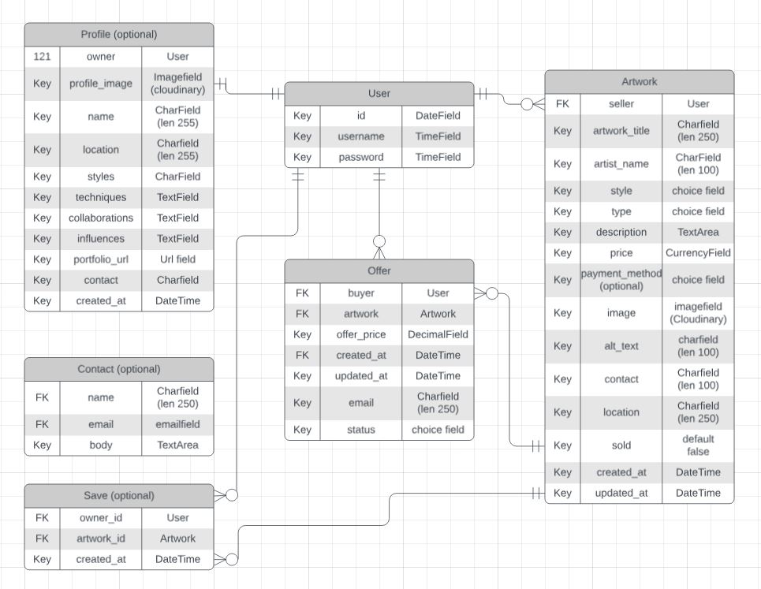
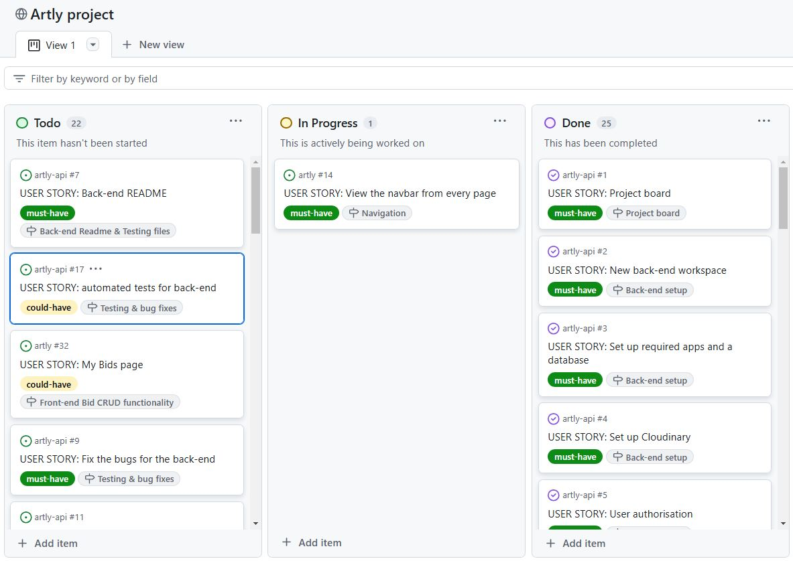
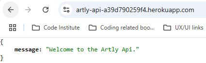

# Artly

This is a README document for the back-end repository Artly_api that provides api functionality to the front-end repository Artly.

You can access the Artly repository [here](https://github.com/laurakond/Artly).

Live site can be found [here](https://artly-a211b809ae81.herokuapp.com/).

(By Laura Kondrataite)

## Table of Contents

[Design](#design)

- [Target Audience](#target-audience)

- [User Stories](#user-stories)

- [Flowcharts](#flowcharts)

- [Endpoints](#endpoints)

[Agile Methodology](#agile-methodology)

- [GitHub Project Management](#github-project-management)

[Features](#features)

- [Existing Features](#existing-features)
- [Features Left to Implement](#features-left-to-implement)

[Technologies used](#technologies-used)

- [Languages](#languages)
- [Frameworks and Libraries](#frameworks-and-libraries)
- [Databases](#databases)
- [Other Tools, technologies, packages](#other-tools-technologies-packages)

[Testing](#testing)

[Deployment](#deployment)

- [Github](#github)
  - [How to Fork](#how-to-fork)
  - [How to Clone](#how-to-clone)
- [Heroku](#heroku)

[Credits](#credits)

- [Content](#content)
- [Used code](#used-code)
- [General resources](#general-resources)
- [Acknowledgments](#acknowledgments)
- [Code inspiration](#code-inspiration)
- [References](#references)

[Return to Table of Contents](#table-of-contents)

## Design

### Target Audience

The primary target audience for the website is:

- persons of any gender aged 16+ who enjoy art,
- artists who wishes to share their work,
- art connoiseurs who are looking for alternative ways in selling owned artwork.

No background, geographical location or income has been specified for the target audience.

### User Stories

For Artly-api part of the project the user stories focuses on the developer's point of view when it comes to project development. All of these stories directly correlate to the front-end user stories, which are covered in the [Artly React](https://github.com/laurakond/artly?tab=readme-ov-file#user-stories) part of this project development.

- the user stories follows the linear proggression of the project, i.e. from the creation of the IDE to the documentation of the project.

|                                                        | As a Developer                                                                                                                                               |
| ------------------------------------------------------ | ------------------------------------------------------------------------------------------------------------------------------------------------------------ |
| [1](https://github.com/laurakond/artly-api/issues/1)   | As a developer I can set up a project board so that I can plan my project.                                                                                   |
| [2](https://github.com/laurakond/artly-api/issues/2)   | As a developer I can set up a new workspace for back-end so that I can start working on my project.                                                          |
| [3](https://github.com/laurakond/artly-api/issues/3)   | As a developer I can set up required apps and a database so that I can manage data and start building the application.                                       |
| [4](https://github.com/laurakond/artly-api/issues/4)   | As a developer I can set up Cloudinary so that any uploaded image can be stored in cloud storage.                                                            |
| [5](https://github.com/laurakond/artly-api/issues/5)   | As a developer I can set up authorisation so that I can validate user registration.                                                                          |
| [6](https://github.com/laurakond/artly-api/issues/6)   | As a developer I can set up JWT tokens so that the user doesn’t need to log in repeatedly during one single session.                                         |
| [7](https://github.com/laurakond/artly-api/issues/7)   | As a developer, I can note the website progression in the back-end README so that anyone can see the steps and actions taken for the release of the website. |
| [8](https://github.com/laurakond/artly-api/issues/8)   | As a developer I can deploy the back-end repository to Heroku so that it is accessible online.                                                               |
| [9](https://github.com/laurakond/artly-api/issues/9)   | As a developer, I can fix the bugs for the back-end so that I can ensure any issues are handled before the initial project release.                          |
| [10](https://github.com/laurakond/artly-api/issues/10) | As a developer, I can perform manual tests for back-end so that I know all functionalities of the website are working.                                       |
| [11](https://github.com/laurakond/artly-api/issues/11) | As a developer, I can validate each page and app for back-end so that I know that the code adheres to best practices.                                        |
| [12](https://github.com/laurakond/artly-api/issues/12) | As a developer, I can create the Artwork model for the api so that I can create functionality for storing artwork related data.                              |
| [13](https://github.com/laurakond/artly-api/issues/13) | As a developer, I can create the Offer model for the api so that I can create functionality for storing offer related data.                                  |
| [14](https://github.com/laurakond/artly-api/issues/14) | As a developer, I can create the Profile model for the api so that I can create functionality for storing profile related data.                              |
| [15](https://github.com/laurakond/artly-api/issues/15) | As a developer, I can create the Save model for the api so that I can create functionality for storing save model related data.                              |
| [16](https://github.com/laurakond/artly-api/issues/16) | As a developer, I can create the Contact model for the api so that I can create functionality for storing Contact model related data.                        |
| [17](https://github.com/laurakond/artly-api/issues/17) | As a developer, I can perform automated for back-end so that I know all functionalities of the website are working.                                          |

### Flowcharts

I used [Lucidchart](https://lucid.app/) for creating the ERD for the models.

- Entity Relationship Diagram:

  

### Endpoints

Below are noted endpoints for each model

[]()

## Agile Methodology

### GitHub Project Management

[GitHub Project board]()

The project was completed using Agile methodology. I have used one Project board for both the API and Front-end repositories in order to keep track of the progress, sometimes revising estimated dates and tasks that were needed to be done by a certain point.

The link to the project board can be found [here](https://github.com/users/laurakond/projects/14).

I used the same Milestones, Epics and labels within the API and Front-end repositories to help organise front-end and back-end user stories. This allowed me to keep track of the progress and ensure that the project MVP was completed in time.

MoSCoW methodology was used to map out which features were required for the MVP, and only address the others if there was sufficient time left.

**Epics**

- **Epic 1:** Project setup - this stage was important to kick start my work on the project, ensuring that initial workspaces were created and appropriate dependencies installed.
- **Epic 2:** Deployment - I set out to deploy the API as soon as possible in order to test any issues that might arise.
- **Epic 3:** User authentication - this part of the project was essential for enabling user-specific authorised access.
- **Epic4:** User registration - this part ensured that the user can create an account and login on the front-end.
- **Epic 5:** User navigation - this allowed the user to navigate the website seamlessly upon login/logout.
- **Epic 6:** Artwork functionality - this feature allows the user to create an artwork listing for sale. It has the main MVP CRUD functionality.
- **Epic 7**: Offer functionality - this feature provided an ability to leave the bid and accept/reject the bid.
- **Epic 8:** Profile functionality (optional) - this feature allows the user to manage their profile.
- **Epic 9:** Save functionality (optional) - this feature allows the user to save their favoured artwork listings.
- **Epic 10:** Contact functionality (optional) - this feature allows the user to report any website errors to the site administration.
- **Epic 11:** Testing and bug fixes - this part of the project was crucial to ensure that the project was working seamlessly and had minor/none bugs.
- **Epic 12:** Documentation - documentation was a crutial part of the project work which allowed me to document the progress and resources used for the develpment of the work.
- **Epic 13**: User nofications - this provided users with notification messages upon various interactivity.
- **Epic 14**: Website design - this part allowed me to assess and improve any design choices/decisions for the front-end of the project as I progressed.

**Back-end Milestones**

- **Milestone 1:** Project board
  - Set up a project board.
- **Milestone 2:** back-end set up
  - Set up a new workspace for backend.
  - Set up required apps and a database.
- **Milestone 3:** deployment
  - Deploy the backend repository to Heroku.
  - Deploy the frontend repository to Heroku.
- **Milestone 4:** Authentication
  - Set up authorization for user registration.
  - Set up JWT tokens for login.
- **Milestone 5:** Navigation
  - Display the navbar from every page.
- **Milestone 6**: Registration
  - Create an account
  - Log in and log out
- **Milestone 7:** Artwork model functionality
  - Write models, serializers, urls, views for Artwork model
- **Milestone 8:** Offer model functionality
  - Write models, serializers, urls, views for Offer model
- **Milestone 9**: Testing & bug fixes
  - Perform automated and manual tests for back-end.
  - Record back-end bugs.
- **Milestone 10:** Back-end Readme & Testing files
  - Validate each back-end page and app.
  - Document the progress in the README and TESTING.md files



- I chose the "trafic-light" color scheme for the MoSCoW method in order to indicate which tasks were a priority (green must-haves) and which ones were not(red won't-haves) for my project board.
  - This provided clarity and better understanding for myself as I was a sole project contributor.

[Return to Table of Contents](#table-of-contents)

## Features

### Existing Features

**Home page**



- Upon loading the Artly api, a welcome screen will display.

---

### Features Left to Implement

**Auto reject bids that are lower than the asked price**

- I have written a code for automatically rejecting the bids based on their bid price, however, I decided to exclude this logic at this stage of the project.

  - I deemed this piece of logic not appropriate for the overall user experience at this stage fo the project. This will be adjusted and incorporated to the functionality of the code at the next development stage.

    ```python
    # Evaluate if the bid offer is lower that the asking price and send
    # appropriate response/update status
      if bid_price < artwork.price:
        instance.status = "Rejected"
        instance.save()

      if bid_price <= 0:
        raise ValidationError("you can only input values above 0.")

      def create(self, request, *args, **kwargs):
        response = super().create(request, *args, **kwargs)
        if response.data.get('status') == "Rejected":
          return Response(
            {"bid_price": "The bid is lower than the asking price."},
            status=status.HTTP_202_ACCEPTED
          )

        return response
    ```

[Return to Table of Contents](#table-of-contents)

## Technologies used

The following languages and technologies have been used to develop the Artly API project.

### Languages

- Python language was used to develop the API-side of the website.
- Markdown language was used to write documentation.

### Frameworks and Libraries

- [Django](https://www.djangoproject.com/) 3.2.25 python framework for he overall project logic implementation
- [Django REST Framework](https://www.django-rest-framework.org/) 3.12.4: for the overall project logic implementation
- [Django allauth](https://allauth.org/) authentication library was used for allowing users to register and login.
- [Pillow](https://pypi.org/project/pillow/) python library was used for file format support.

### Databases

- PostgreSQL: the database used to store all the data.
- Sqlite3: the database used for automated testing.

### Other tools, technologies, packages

- [Cloudinary](https://cloudinary.com/home) was used for storing images in cloud storage.
- [Django CORS headers](https://pypi.org/project/django-cors-headers/) was used for handling the server headers which allowed to link the project back-end and front-end.
- [Django filter](https://django-filter.readthedocs.io/en/stable/) was used to apply filtering and search functionality for the API.
- [GitHub](https://github.com/) was used for creating and storing files and folders of the website.
- [Heroku](https://www.heroku.com) was used for accessing and storing my application game.
- **Git** was used for version control.
- **Pip** was used to install required dependencies.
- **Gitpod** cloud editor was used for writing the code.
- **Gunicorn** webserver used to run the website.
- [CI Python Linter](https://pep8ci.herokuapp.com/#) was used for validating and checking my code for best code practices.
- [Lucidchart](https://lucid.app/) was used for creating ERDs.
- [Simple JWT](https://django-rest-framework-simplejwt.readthedocs.io/en/latest/) was used to provide JSON web token authentication back-end for the Django Rest framework.

Full list of dependencies used for the project can be found in the requirements.txt file.

[Return to Table of Contents](#table-of-contents)

## Testing

The website went through extensive testing during the development and deployment stages.

- See [TESTING.md](TESTING.md) file for full testing and validation information.

[Return to Table of Contents](#table-of-contents)

## Deployment

This website was deployed using GitHub pages and Heroku website. To deploy the project, follow the steps below:

### Github

1. Login to GitHub and navigate to the main repository page.
2. Click on the chosen repository,for example [Stitch Art Guides](https://github.com/laurakond/Stitch-Art-Guides-pp4).
3. Once inside the repository, click on the "Settings" tab above the repository title displayed around the middle of the page.
4. Select "Pages" tab on the left side navigation menu.
5. Select "main" or "master" branch under "Build and Deployment", then "root" folder and click "save" button.
6. The GitHub page site will be deployed.
   - It might take a few minutes to generate the "live" website link.

The live link to the website can be found [here](https://stitch-art-guides-pp4-5a679feed1e1.herokuapp.com/).

#### How to Fork

To fork the repository in Github:

1. Follow steps 1 & 2 as above.
2. Once inside the chosen repository, click the "fork" button in the top right corner above the "About section".

#### How to Clone

To clone the repository in Github:

1.  Follow steps 1 & 2 as in the deployment section above.
2.  Click on the "Code" button (often a bright color that stands out) at the top right corner just above the "commits" history.
    - Select whether you would like to clone with HTTPS, SSH or GitHub CLI and copy the link shown.
3.  Open the terminal in your chosen code editor and change the current working directory to the location you want to use for the cloned directory.
    - Type 'git clone' into the terminal and then paste the copied link and press enter.
    - OR, if working with VSCode, select "Clone Git Repository" and save the file on your device as prompted.
4.  If you are working on a local IDE such as VS code, you need to create a virtual environment:
    - in the terminal write the command `python -m venv [directory-name]`
    - To activate the virtual environment write `[directory-name]/Scripts/Activate`
    - If you need to deactivate it, type `deactivate` in the terminal
    - remember to include this to the .gitignore file
5.  Next, create an env.py file where you will keep your key data and make sure it is included in the .gitignore file. Key data may include:
    - DATABASE_URL
    - SECRET_KEY
    - CLOUDINARY_URL
    - SITE_OWNER_EMAIL
    - SITE_OWNER_PASSWORD
6.  Import all the dependencies required for the project to run. You can do so by entering `pip install -r requirements.txt` for VSCode or `pip3 install -r requirements.txt` for Gitpod IDE.
7.  Set up a database using postgreSQL.

### Heroku

To deploy to Heroku, follow the steps below.

**Please remember** to check that your DEBUG in the settings.py file is set to FALSE before deploying to Heroku.

- Log in to Heroku.
- Click 'Create new App'.
- Write a unique project name and select your region from the drop down.
- Select 'Settings' tab.
- Click on 'Reveal Config Vars' button
- Enter the following key/value pairs:
  - ALLOWED_HOST: add your allowed host url from settings.py
  - CLIENT_ORIGIN: add your front-end deployed url
  - CLIENT_ORIGIN_DEV: add your front-end local environment url
  - CLOUDINARY_URL: add your cloudinary api key from env.py
  - DATABASE_URL: add your database url
  - DISABLE_COLLECTSTATIC: set to '1'
  - SECRET_KEY: add your secret key from env.py
- Click on the 'Deploy' tab to the left of the 'Settings' tab
- Select Github (or other platform if you are using another one) to connect to Heroku.
- Type out your project name in the 'Deployment method' section and select your project repository
- Once connected, scroll to the bottom and click 'Deploy Branch' button
- When it has finished deploying, click on the 'View' button below or 'Open App' at the top right corner
- If the deployment was successful you will be taken to the deployed site.

[Return to Table of Contents](#table-of-contents)

## Credits

### Content

### Used code

- Bid model status field logic
  - I was struggling to understand how to approach the logic for my bid model status field. I was able to find a solution after speaking to a mentor, reading a couple of articles, DRF documentation.
  - I also referred to AsiaWi's [Snap it up](https://github.com/AsiaWi/snap-it-up-backend/blob/main/offers/views.py) snippet of code to help me write the logic and functionality for my Bid views.
    - other resources are noted in the general resources section.

### General resources:

<details>
<summary>Serializers</summary>

- [Serializers – Django REST Framework](https://www.geeksforgeeks.org/serializers-django-rest-framework/)
- [Model serializer in DRF](https://www.geeksforgeeks.org/modelserializer-in-serializers-django-rest-framework/)
</details>

- [The Perfect Match: How to Integrate ReactJS with Django Framework for Stunning Web Apps](https://medium.com/@devsumitg/how-to-connect-reactjs-django-framework-c5ba268cb8be)
- [Full Stack app with ReactJS & Django - Nabendu Biswas Full Stack app with ReactJS & Django](https://nabendu82.medium.com/full-stack-app-with-reactjs-django-0cb33b9835b2)
- [Ukeme Wilson Mastering Django REST Framework: An In-depth Guide](https://medium.com/@ukemeboswilson/mastering-django-rest-framework-an-in-depth-guide-to-serializers-5e6b94530c7a)
- [10 things you need to know to use drf](https://profil-software.com/blog/development/10-things-you-need-know-effectively-use-django-rest-framework/)

- Django Rest Framework tutorials

  - [Pedro Tech](https://www.youtube.com/watch?v=NoLF7Dlu5mc)
  - [Tech with Tim](https://www.youtube.com/watch?v=t-uAgI-AUxc)
  - [Bryan Brkic](https://www.youtube.com/watch?v=Oz3SoVV27ak)

- Django filters:

  - [Integration with DRF](https://django-filter.readthedocs.io/en/stable/guide/rest_framework.html)
  - [Tom Christie Filtering DRF](https://www.django-rest-framework.org/api-guide/filtering/#orderingfilter)

- DRF views:

  - [How to use get_object() in DRF generics views](https://medium.com/@katheller/how-to-use-get-object-in-drf-generics-views-examples-a7b879ff2d50)
  - [How to create REST API with DRF](https://blog.logrocket.com/django-rest-framework-create-api/)
  - [PUT request to django api](https://karthiksharma1411.medium.com/put-request-to-django-api-to-update-list-of-nested-objects-with-many-to-many-relationships-f487cba97632)
  - [Understanding api views](https://medium.com/@hordunlarmy/understanding-apiview-generic-views-and-viewsets-in-django-rest-framework-0d89ac6b9614)
  - [DRF views part2](https://testdriven.io/blog/drf-views-part-2/)

- DRF super().save():

  - [Stackoverflow - super method from django documentation](https://stackoverflow.com/questions/35650746/super-method-from-django-documentation)
  - [Stackoverflow - why save method has another save method](https://stackoverflow.com/questions/60523103/why-save-method-has-another-save-method-with-super-in-django-model)
  - [Geek for geeks - overriding the save method](https://www.geeksforgeeks.org/overriding-the-save-method-django-models/)
  - DRF object creation
    - [DRF object creation](https://medium.com/@lakshminp/drf-object-creation-methods-60476bb9783e)
    - [DRF when to use viewsets](https://www.reddit.com/r/django/comments/sm07s2/drf_when_to_use_viewsets_vs_generic_views_vs/)

- DRF (de)serialization and validation

  - [DRF serialization](https://medium.com/django-unleashed/django-rest-framework-serialization-deeper-look-part-1-cf40108f9deb)

- This code (PUT) was really relevant to the code for **bid**: [](https://cheat.readthedocs.io/en/latest/django/drf_serializers.html)
  - [Partial serializer updates](https://www.django-rest-framework.org/api-guide/serializers/#partial-updates)
  - [Stackoverflow - How do I validate input in DRF before creation](https://stackoverflow.com/questions/68514309/how-do-i-validate-input-in-django-rest-framework-before-creation)
  - [Stackoverflow - calidate specific field in drf serializer](https://stackoverflow.com/questions/46173838/validate-specific-field-in-drf-serializer)

### Acknowledgments

My thanks go to:

- My mentor, [Iuliia Konovalova](https://github.com/IuliiaKonovalova), for helping to organise and plan my project and for advising how to approach this project.

- My fellow student, [Vernell Clark](https://github.com/VCGithubCode), for moral support and advice on how to approach project planning.

- [Daisy McGirr](https://github.com/Dee-McG) for helping to cristalise my project idea, troubleshooting concepts I could not wrap my head around and tremendous moral support throughout this project.

### Code Inspiration

### References

- I used Code Institute's DRF API [project](https://github.com/Code-Institute-Solutions/drf-api/tree/ed54af9450e64d71bc4ecf16af0c35d00829a106) as a base for my own.
- As noted in the [used code](#used-code) section, I have referred to AsiaWi's [Snap it up](https://github.com/AsiaWi/snap-it-up-backend) project.

[Return to Table of Contents](#table-of-contents)
