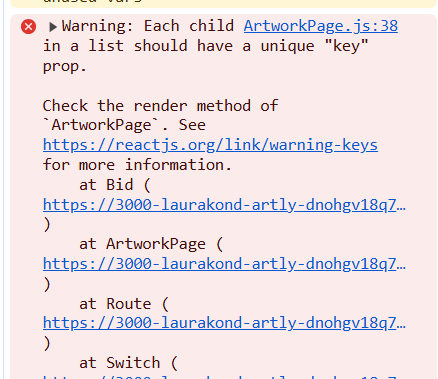

# Testing for Artly_api

By Laura Kondrataite

## Contents

[Testing](#testing)

- [PEP8 Linter validation](#pep8-linter-validation)
- [Bugs](#bugs)

  - [Fixed bugs](#fixed-bugs)
  - [Unfixed bugs](#unfixed-bugs)

- [User stories testing](#user-stories-testing)
- [User testing](#user-testing)
- [Manual testing](#manual-testing)
- [Restricted access testing](#restricted-access-testing)
- [Automated testing](#automated-testing)

## Testing

### PEP8 Linter validation

- All files have been validated using Code Institute's [Pep8 Python linter validator service](https://pep8ci.herokuapp.com/).

  - No errors were found.

- See full [CI Python linter report](documentation/docs/ci-python-linter.pdf).

[Return to Table of Contents](#contents)

## Bugs

### Fixed bugs

**error django.db.utils.IntegrityError: NOT NULL constraint failed**

- received the above error for the 'phone' field in the Bids model.
  - I resolved it by applying null=True, as suggested in this Stack overflow [thread](https://stackoverflow.com/questions/72943699/error-django-db-utils-integrityerror-not-null-constraint-failed).
  - Eventually, I decided to remove the phone field from the model as it was redundant since I have included the email field as well.

**Attribute error at /bids/1/**


- I received this error when I tried to initially access the detail view for the bid. - To resolve it, I created a new permission rule _IsSellerOrReadOnly_ so that the seller would be able to access the edit view in order to manage the state of the bid.
  - **Note:** the _IsSellerOrReadOnly_ rule has been removed after this error was noted down. I managed to fix the error without having to rely on this rule.

**Testing BidListview**

- I was struggling to get the bid count calculate correctly in the test even though the response.data was printing correct count. After a lot of searching I found this [thread](https://stackoverflow.com/questions/52827996/how-do-i-test-the-foreign-key-object-on-django-model/52828084) on Stackoverflow that helped me to figure out how to target values in the the post response:

  - The problem was solved when I applied an id to the artwork key:

    ```python
    'artwork': self.artwork.id,
    ```

**Incorrect bid value input instance**

- when writing code for validating incorrect bid_price value, I noticed that the bid would be created regardless if it was ≤0. I realised this was because the logic statement to validate the user input was written after the new data has been saved and serialized: instance = serializer.save(buyer=self.request.user)
  - Once I moved the logic above this line, the bid instances were not being saved if the input was ≤0.
- This seems to have resolved automated testing issues that I had when trying to write a test for validating incorrect bid input.

**Filtering by artwork id**

- When testing the bid input functionality on the front end, I received the following error a couple of times:

  

**Fetching sold artwork count**

- I was having problems targetting sold_artwork_count for the Profile views.
  - I managed to resolve this by looking at a similar code provided by Code Institute's DRF api walkthrough and also referring to Django documentation on:
    - [Conditional aggregation](https://docs.djangoproject.com/en/5.1/ref/models/conditional-expressions/#conditional-aggregation)
    - [Filtering on annotations](https://docs.djangoproject.com/en/5.1/topics/db/aggregation/#following-relationships-backwards)

### Unfixed bugs

No unfixed bugs were noted at the time of testing the application.

[Return to Table of Contents](#contents)

### User stories testing

- APi functionality is reflective of the front-end application functionality, therefore full user testing is covered in the Artly front-end repository. You can find it [here](https://github.com/laurakond/artly/blob/main/TESTING.md#user-stories-testing).

[Return to Table of Contents](#contents)

### User testing

The application was tested during the development and post-development stages. I have asked my friends and peers to notify me of any issues that might appear. No issues were reported/noted during the development and post-development.

[Return to Table of Contents](#contents)

### Manual testing

[Return to Table of Contents](#contents)

### Automated Testing

- Automated testing has been implemented for the following:

  - Artwork model
  - Bid model

  

[Return to Table of Contents](#contents)

[Return to the main README.md](README.md)
