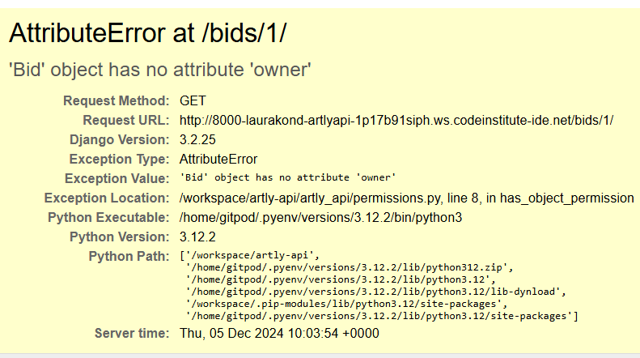
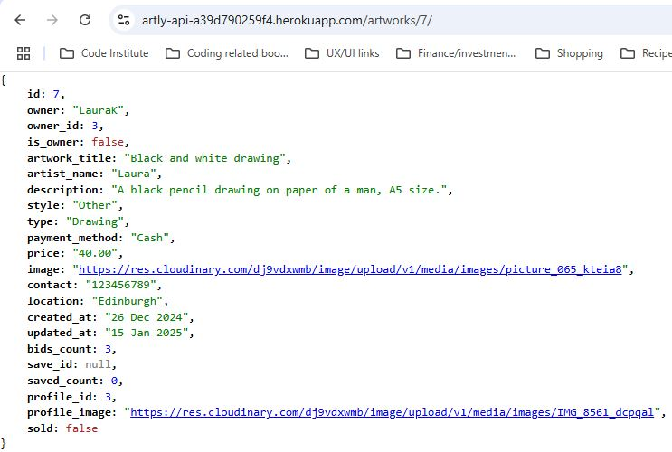
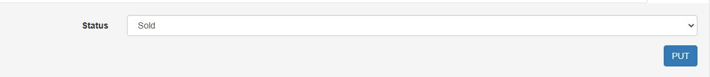

# Testing for Artly_api

By Laura Kondrataite

## Contents

[Testing](#testing)

- [PEP8 Linter validation](#pep8-linter-validation)
- [Bugs](#bugs)

  - [Fixed bugs](#fixed-bugs)
  - [Unfixed bugs](#unfixed-bugs)

- [User stories testing](#user-stories-testing)
- [User testing](#user-testing)
- [Manual testing](#manual-testing)
- [Restricted access testing](#restricted-access-testing)
- [Automated testing](#automated-testing)

## Testing

### PEP8 Linter validation

- All files have been validated using Code Institute's [Pep8 Python linter validator service](https://pep8ci.herokuapp.com/).

  - No errors were found.

- See full [CI Python linter report](documentation/docs/ci-python-linter.pdf).

[Return to Table of Contents](#contents)

## Bugs

### Fixed bugs

**error django.db.utils.IntegrityError: NOT NULL constraint failed**

- received the above error for the 'phone' field in the Bids model.
  - I resolved it by applying null=True, as suggested in this Stack overflow [thread](https://stackoverflow.com/questions/72943699/error-django-db-utils-integrityerror-not-null-constraint-failed).
  - Eventually, I decided to remove the phone field from the model as it was redundant since I have included the email field as well.

**Attribute error at /bids/1/**



- I received this error when I tried to initially access the detail view for the bid. - To resolve it, I created a new permission rule _IsSellerOrReadOnly_ so that the seller would be able to access the edit view in order to manage the state of the bid.
  - **Note:** the _IsSellerOrReadOnly_ rule has been removed after this error was noted down. I managed to fix the error without having to rely on this rule.

**Testing BidListview**

- I was struggling to get the bid count calculate correctly in the test even though the response.data was printing correct count. After a lot of searching I found this [thread](https://stackoverflow.com/questions/52827996/how-do-i-test-the-foreign-key-object-on-django-model/52828084) on Stackoverflow that helped me to figure out how to target values in the the post response:

  - The problem was solved when I applied an id to the artwork key:

    ```python
    'artwork': self.artwork.id,
    ```

**Incorrect bid value input instance**

- when writing code for validating incorrect bid_price value, I noticed that the bid would be created regardless if it was ≤0. I realised this was because the logic statement to validate the user input was written after the new data has been saved and serialized: instance = serializer.save(buyer=self.request.user)
  - Once I moved the logic above this line, the bid instances were not being saved if the input was ≤0.
- This seems to have resolved automated testing issues that I had when trying to write a test for validating incorrect bid input.

**Filtering by artwork id**

- When testing the bid input functionality on the front end, I received the following error a couple of times:

  

  - Upon further investigation I noticed that the bids created for one artwork where being displayed in all artwork pages regardless of their id.
  - I realised that the error was occuring because the filter settings for the bids in the back-end were not set up to filter by artwork id.
  - I managed to get this resolved by updating the filter settings, and after running a test on the front end it seems to have fixed the issue.

**Fetching sold artwork count**

- I was having problems targetting sold_artwork_count for the Profile views.
  - I managed to resolve this by looking at a similar code provided by Code Institute's DRF api walkthrough and also referring to Django documentation on:
    - [Conditional aggregation](https://docs.djangoproject.com/en/5.1/ref/models/conditional-expressions/#conditional-aggregation)
    - [Filtering on annotations](https://docs.djangoproject.com/en/5.1/topics/db/aggregation/#following-relationships-backwards)

**Artist name field in Artwork model**

- I noticed that if the user chose to leave the artist name field blank, the field was not populating preset default name as `"unknown artist"`.
  - This seems to have been caused by the blank=True attribute within the field.
  - The issue has been fixed once I removed the blank=True from the artist name field.

### Unfixed bugs

No unfixed bugs were noted at the time of testing the application.

[Return to Table of Contents](#contents)

### User stories testing

- API functionality is tied closely with the front-end application, without which the front-end would not work as intended. Therefore, below used user stories are taken from the front end. To see the front end user stories testing follow this [link](https://github.com/laurakond/artly/blob/main/TESTING.md#user-stories-testing).

| As a site user                                                                                                                           | Requirements met | Image                                                                                                                                                                                                                          | Comments                                                                                                                                                                                                    |
| ---------------------------------------------------------------------------------------------------------------------------------------- | ---------------- | ------------------------------------------------------------------------------------------------------------------------------------------------------------------------------------------------------------------------------ | ----------------------------------------------------------------------------------------------------------------------------------------------------------------------------------------------------------- |
| As a site user                                                                                                                           |                  |                                                                                                                                                                                                                                |                                                                                                                                                                                                             |
| As a site user I can login to & logout of the website so that I can access functionality for logged in users.                            | Yes              |                                                                                                                                                                     |
| As a site user I can see a list of posted artworks on the home page so that I can clearly see the latest posts that have been published. | Yes              |                                                                                                                                                             |
| As a logged in user I can create my own artwork post so that I can share it with others and sell it.                                     | Yes              |                                                                                                                                                        |
| As a site user I can edit the artwork post so that I can show the most up to date information.                                           | Yes              |                                                                                                                                                   |
| As a site user I can delete the artwork post so that it is no longer visible on the website for others to see.                           | Yes              |                                                                                                                                                         |
| As a site user I can access a detailed artwork post so that I can read more about it.                                                    | Yes              |                                                                                                                                                   |
| As a buyer I can make a bid the artwork so that I can buy it.                                                                            | Yes              |                                                                                                                                                                  |
| As a buyer I can delete my bid so that I can control removal of my bid for the artwork’s post.                                           | Yes              |                                                                                                                                                                 |
| As a seller I can review pending bids so that I can decide which seller to sell the artwork to.                                          | Yes              |                                                                                                                                                     |
| As a seller I can set the artwork page as sold so that it is clear to the buyers the artwork is sold.                                    | Yes              |                                                                                                                                                              |
| As a seller I can get in touch with the buyer to organise the collection of the artwork.                                                 | Yes              |                                                                                                                                                                                                                                | This feature is implemented in the front end using mailto                                                                                                                                                   |
| As a logged in user I can update my profile so that I can keep it up-to-date with most relevant information.                             | Yes              |    |
| As a logged in user I can save the artwork post so that I can access them in one place.                                                  | Yes              |                 |
| As a site user I can search for artworks by keyword or filter by category/style so that I can find listings relevant to my interests.    | Yes              |                     |
| As a site user, I can see notification messages so that I know that my action was successful/completed.                                  | Yes              |                                                                                                                                                                                                                                | Notifications are implemented in the front end using Toastify. See front end [user stories testing](https://github.com/laurakond/artly/blob/main/TESTING.md#user-stories-testing) for notification messages |
| As a site user, I can follow or unfollow another user so that I can follow any updates from another user.                                | Yes              |                                                                                                                                                             |
| As a site user I can submit a contact form to site admins so that I can report any issues with the website.                              | No               |                                                                                                                                                                                                                                | This feature will be looked into at the next development stage                                                                                                                                              |
| As a site user, I can see the My bids tab so that I can access and see all of the bids I submitted.                                      | No               |                                                                                                                                                                                                                                | This feature will be looked into at the next development stage                                                                                                                                              |

[Return to Table of Contents](#contents)

### User testing

The application was tested during the development and post-development stages. I have asked my friends and peers to notify me of any issues that might appear. No issues were reported/noted during the development and post-development.

[Return to Table of Contents](#contents)

### Manual testing

After the development stage of the application, I went through each feature, ensuring that the website is working as intended.

| Page                                                                     | User Actions                                                                         | Expected Results                                                                                                                                   | Y/N | Comments                                                                                                                                                                                                                                       |
| ------------------------------------------------------------------------ | ------------------------------------------------------------------------------------ | -------------------------------------------------------------------------------------------------------------------------------------------------- | --- | ---------------------------------------------------------------------------------------------------------------------------------------------------------------------------------------------------------------------------------------------- |
| Home Page                                                                |                                                                                      |                                                                                                                                                    |     |                                                                                                                                                                                                                                                |
| 1                                                                        | Click on the Login button                                                            | Redirects to the route route and displays "welcome to the Artly api" message                                                                       | Y   |                                                                                                                                                                                                                                                |
| Artworks list                                                            |                                                                                      |                                                                                                                                                    |     |                                                                                                                                                                                                                                                |
| 1                                                                        | Enter any values in the artwork form fields                                          | Will accept any value.                                                                                                                             | Y   | Required fields will be flagged with "this field may not be blank."                                                                                                                                                                            |
| 2                                                                        | Chooses large image file                                                             | Validation messages appear for size, width or height: "Image larger than 2MB", "Image width larger than 4096px", "Image height larger than 4096px" |     |                                                                                                                                                                                                                                                |
| 2                                                                        | Click the post button                                                                | Redirects to artwork detail page                                                                                                                   | Y   |                                                                                                                                                                                                                                                |
| Artwork Detail view                                                      |                                                                                      |                                                                                                                                                    |     |                                                                                                                                                                                                                                                |
| 1                                                                        | Enter value to any of the fields in the artwork form                                 | Will accept any value.                                                                                                                             | Y   |                                                                                                                                                                                                                                                |
| 2                                                                        | Click the put button                                                                 | Updates the instance and redirects to the artwork detail page                                                                                      | Y   |                                                                                                                                                                                                                                                |
| 3                                                                        | Click delete button                                                                  | Modal appears asking to confirm the deletion of the artwork                                                                                        | Y   |                                                                                                                                                                                                                                                |
| 4                                                                        | Click delete button in the modal                                                     | Displays HTTP 204 No content in the artwork detail view                                                                                            | Y   |                                                                                                                                                                                                                                                |
| Bids list view                                                           |                                                                                      |                                                                                                                                                    |     |                                                                                                                                                                                                                                                |
| 1                                                                        | Select an artwork title, enter price and email values to the bid form                | Will accept numberical and email values respectively                                                                                               | Y   | Required fields will be flagged with for the bid price: "A valid number is required.". Email: "This field may not be blank."                                                                                                                   |
| 2                                                                        | Enter a negative or 0 value in bid price field                                       | Returns validation message "Invalid input. Please enter values above 0."                                                                           | Y   |                                                                                                                                                                                                                                                |
| 3                                                                        | Click the post button                                                                | Redirects to the bid detail page                                                                                                                   | Y   | If the user chooses their own artwork to bid on, the following validation message appears: "You cannot bid on your own artwork." If the artwork is already marked as sold, "This artwork is no longer available for purchase" message appears. |
| Bid detail view(for users who are the buyers)                            |                                                                                      |                                                                                                                                                    |     |                                                                                                                                                                                                                                                |
| 1                                                                        | Click the delete button                                                              | Modal appears asking to confirm the deletion of the bid                                                                                            | Y   |                                                                                                                                                                                                                                                |
| 2                                                                        | Click delete button in the modal                                                     | Displays HTTP 204 No content in the artwork detail view, and "Bid deleted successfully." message shown                                             | Y   |                                                                                                                                                                                                                                                |
| 3                                                                        | Choose accept/reject/mark as sold from the drop down bid status and click Put button | Displays HTTP403 forbidden in the artwork detail view                                                                                              | Y   | The message is displayed "Only the seller can modify this bid."                                                                                                                                                                                |
| Bid detail view(for users who are the sellers, ie owners of the artwork) |                                                                                      |                                                                                                                                                    |     |                                                                                                                                                                                                                                                |
| 1                                                                        | Click the delete button                                                              | Displays HTTP403 forbidden in the artwork detail view and "Only the buyer can delete this bid." message displayed.                                 | Y   |                                                                                                                                                                                                                                                |
| 2                                                                        | Choose accept or reject from the drop down list and click put button                 | Updates the bid status in detail view                                                                                                              | Y   |                                                                                                                                                                                                                                                |
| 3                                                                        | Choose "mark as sold" from the drop down and click put button                        | HTTP 200 OK is displayed and message "Bid accepted and the artwork is no longer available." shown                                                  | Y   |                                                                                                                                                                                                                                                |
| 4                                                                        | Choose "mark as sold" from the drop down for the same bid again and click put button | HTTP 400 Bad request is displayed and "Artwork is no longer available for purchase." message shown                                                 | Y   |                                                                                                                                                                                                                                                |
| Profile detail view                                                      |                                                                                      |                                                                                                                                                    |     |                                                                                                                                                                                                                                                |
| 1                                                                        | Enter value to any of the fields in the profile detail form                          | Will accept any value.                                                                                                                             | Y   |                                                                                                                                                                                                                                                |
| 2                                                                        | Click the put button                                                                 | Updates the instance and redirects to the artwork detail page                                                                                      | Y   |                                                                                                                                                                                                                                                |
| Save artwork List view                                                   |                                                                                      |                                                                                                                                                    | Y   |                                                                                                                                                                                                                                                |
| 1                                                                        | Choose from the drop down artwork list and click post button                         | HTTP 201 Created displayed in the saved detail view                                                                                                | Y   | If the same artwork is selected more than once, 400 Bad request "possible dupblicate" message appears                                                                                                                                          |
| Saved artwork detail                                                     |                                                                                      |                                                                                                                                                    | Y   |                                                                                                                                                                                                                                                |
| 1                                                                        | Click delete button                                                                  | Modal appears asking to confirm the deletion of the saved artwork instance                                                                         | Y   |                                                                                                                                                                                                                                                |
| 2                                                                        | Click delete button in the modal                                                     | Displays HTTP 204 No content in the saved artwork detail view                                                                                      | Y   |                                                                                                                                                                                                                                                |
| Followed list view                                                       |                                                                                      |                                                                                                                                                    | Y   |                                                                                                                                                                                                                                                |
| 1                                                                        | Choose from the drop down profile list and click post button                         | HTTP 201 Created displayed in the followed detail view                                                                                             | Y   | If the same profile is selected more than once, 400 Bad request "possible dupblicate" message appears                                                                                                                                          |
| Followed detail                                                          |                                                                                      |                                                                                                                                                    |     |                                                                                                                                                                                                                                                |
| 1                                                                        | Click delete button                                                                  | Modal appears asking to confirm the deletion of the followed profile instance                                                                      | Y   |                                                                                                                                                                                                                                                |
| 2                                                                        | Click delete button in the modal                                                     | Displays HTTP 204 No content in the followed artwork profile view                                                                                  | Y   |                                                                                                                                                                                                                                                |

[Return to Table of Contents](#contents)

### Restricted access testing

I have implemented restricted access to specific content that is only allowed to the users who are authorised.

| Page             | User action                                                     | Expected Results                                                   | Y/N |
| ---------------- | --------------------------------------------------------------- | ------------------------------------------------------------------ | --- |
| Artwork list     | Type in the url address for artwork list view                   | Displays Read only list view                                       | Y   |
| Artwork detail   | Type in the url address for an artwork detail view              | Displays Read only detail view                                     | Y   |
| Bid List         | Type in the url address for bid list view                       | Displays Read only list view                                       | Y   |
| Bid detail       | Type in the url address for an individual bid detail view       | Displays "You don't have access to modify this bid." message       | Y   |
| Profile list     | Type in the url address for profile list view                   | Displays Read only view of profile list                            | Y   |
| Profile detail   | Type in the url address for an individual profile detail view   | Displays Read only view of an individual profile instance          | Y   |
| Saved list       | Type in the url address for saved artworks list view            | Displays Read only view of saved list                              | Y   |
| Saved detail     | Type in the url address for an individual saved detail view     | Displays Read only view of an individual saved artwork instance    | Y   |
| Followers list   | Type in the url address for followers list view                 | Displays Read only view of followers list                          | Y   |
| Followers detail | Type in the url address for an individual followers detail view | Displays Read only view of an individual followed profile instance | Y   |

[Return to Table of Contents](#contents)

### Automated Testing

- Automated testing has been implemented for the following:

  - Artwork model:

    - logged in user can create an artwork
    - user can list the artworks in a list
    - unauthorised user can't create an artwork
    - retrieve an artwork by id
    - can't retrieve an artwork by id
    - logged in user can update their artwork instance
    - logged in user can't update not their artwork instance

  - Bid model:
    - List of bids is shown
    - logged in user can create a bid with correct value
    - logged out user can't create a bid
    - logged in user can't submit the value of 0
    - logged in user can't submit a negative value

  

[Return to Table of Contents](#contents)

[Return to the main README.md](README.md)
